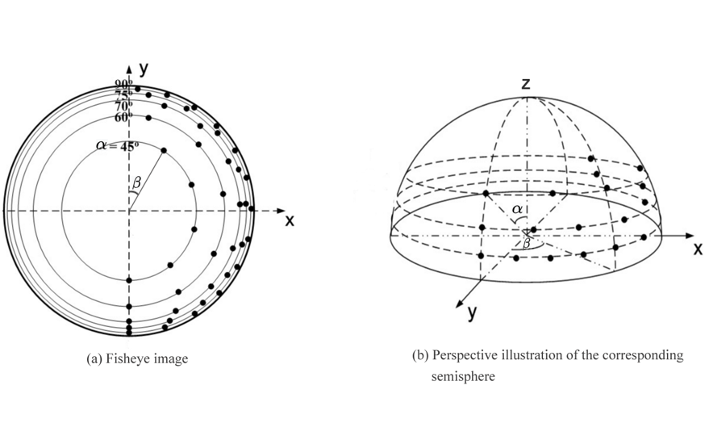
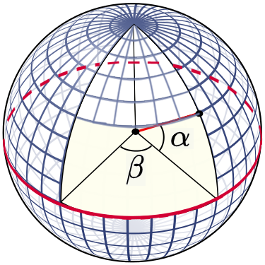
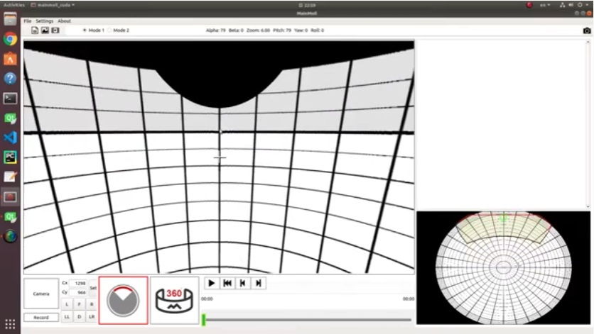
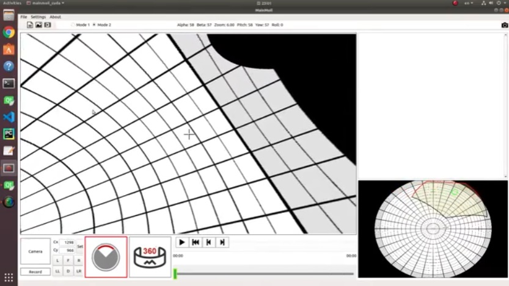
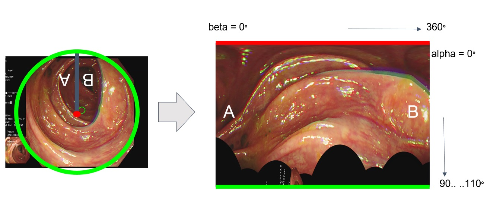
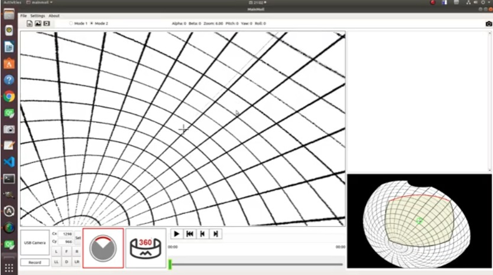

Getting Started
################

This section is for you if you are a developer and are using Moildev Library for the first time.

Installation
================

You have two options for install Moildev library. The first option to access the Moildev library is directly install
from the `PyPI distribution <https://pypi.org/project/Moildev/>`_. You just need to execute the command bellow:

.. code-block:: bash

    $ pip install Moildev

Alternatively, you can choose the second option,
which involves cloning the Moildev repository directly from `GitHub <https://github.com/perseverance-tech-tw/moildev>`_.

.. code-block:: bash

    $ git clone https://github.com/perseverance-tech-tw/moildev.git

Basic Concept
==============

The Fisheye lens, also known as the Fisheye image sensor (FIS),
is a unique ultra-wide-angle lens with a short focal length
that generates considerable optical distortion and is designed to provide a wide,
panoramic, or hemispherical image.

The large field of view is the most important characteristic.
With a FOV of more than 180 degrees, a Fisheye camera (also known as a Fisheye image sensor, or FIS)
can capture a clear image, but a severer barrel distortion comes along.

According to Prof. Chuang-Jan Chang, the approach to displaying Fisheye camera images incorporates multicollimator
metrology and cartography in order to methodically characterize the Fisheye camera's projection mechanism.

The hemisphere coordinate system is produced by the Fisheye camera in our suggested technique.
Hence, the position of an imaged point referring to the principal point on the image plane
directly reflects its corresponding zenithal distance (alpha). and azimuthal distance (beta) of
the sight ray in space to normalize the imaged point onto a small sphere presented in the following figure:

Based on the coordinate system, the angles respectively defined by incident rays and the optical axis are the zenithal angle (alpha)
and the azimuthal angle (beta), which are the angles surrounding the optical axis.

It has a relationship with the coordinate system X, Y, and Z, where the optical axis is defined by the Z-axis.
For the zenithal angle, it is the angle from the vertical optical axis to the X- and Y-axes, as shown in Figure A.

Whereas the azimuthal angle is defined as the angle of positive Y as the reference point with a value of 0 degrees and
the Z-axis is used as the rotation axis, as shown in Figure B. The rotation around the optical axis is the angle of
the Y axis, starting from the positive direction and clockwise around the X axis.

.. list-table::

    * - .. figure:: assets/zenithal_angle.jpg
           :align: center

           A.Zenithal Angle

      - .. figure:: assets/azimuthal_angle.jpg
           :align: center

           B.Azimuthal Angle

1. Anypoint
-----------
When dealing with fisheye images, you may want to turn them back into regular, undistorted images at a particular angle.
To achieve this, there are two straightforward ways you can choose to indicate the angle you desire for the restoration process (Usually we call anypoint).:

|

**Mode 1 : ( Pitch, Roll )**

|

**Mode 2 : ( Pitch, Yaw)**

|

2. Panorama
------------

The process involves the expansion of a hemispherical image onto a two-dimensional plane resembling a world map.
This expansion allows for a comprehensive representation of the entire hemispherical view in a format suitable for analysis and visualization.
Additionally, the resulting processed image enables further examination and detection of tubular objects,
providing valuable insights and information for subsequent stages of the data processing pipeline.

|

By utilizing spherical coordinate rotation, which refers to Rodrigues' rotation formula, the fisheye image can be
transformed to face a different angle, providing a fresh perspective on the scene. This technique finds practical
application in handling tubular images, where objects appear at various positions in relation to the vanishing point of the tube.
Through a process known as normalization, these objects can be made to conform to a standardized scale,
facilitating a better understanding of their sizes and proportions.

|

