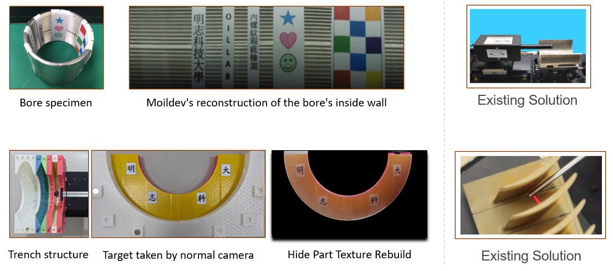

Sample Application
###################

1. Car Application
==================

There are several implementations of Moildev in car applications, including Driver Monitoring Systems (DMS), birds-eye view, and dash cameras.
Below, you can find examples showcasing the impressive results achieved through our Moildev implementation in these car-related applications.

**Driver Monitoring System (DMS)**

..  youtube:: Z5EtsPGONW8
    :width: 100%
    :align: center
|

**Moildev Birds View**

..  youtube:: t0WoHAfyE9o
    :width: 100%
    :align: center
|
..  youtube:: Vkep3_SpWkQ
    :width: 100%
    :align: center

|

**Advanced Moildev birds view configuration**

..  youtube:: 9v3VWt_3rAI
    :width: 100%
    :align: center

|

2. Internal Thread Inspection
=============================

Internal thread inspection refers to the process of evaluating and assessing the quality and integrity of threads inside a cylindrical component, such as a nut or a threaded hole.
This inspection is critical in various industries, including manufacturing, aerospace, automotive, and engineering, where threaded components play a vital role in assemblies and connections.

Moildev proves to be an excellent platform for processing fisheye images in internal thread inspection applications.
With its ability to handle larger fields of view (FOV) offered by fisheye images, Moildev enables faster and more efficient inspection processes, resulting in a reduced error rate.
Leveraging fisheye images in internal thread inspection allows for a more comprehensive and accurate assessment of threaded components, ensuring their proper fit and functionality.

|

**live demo our moildev for thread inspection**

..  youtube:: o0Zj67bcqE4
    :width: 100%
    :align: center

|

3. 3D measurement
=================

Moildev is not only proficient in fisheye image processing but also excels in high-accuracy 3D measurements.
It enables measurements in any direction and covers areas captured by the fisheye lens.
This versatility allows for precise and comprehensive 3D measurements, making Moildev a powerful tool in various
applications that require accurate spatial analysis. Whether it's for industrial metrology, robotics, or other fields,
Moildev's capabilities in 3D measurement add a new dimension of accuracy and efficiency to the process, ensuring reliable and valuable data insights.

..  youtube:: cDuTrog51xY
    :width: 100%
    :align: center
|

4. Visual odometry
==================

Visual odometry is a technique used in computer vision and robotics to estimate the movement and position of a camera or
a vehicle by analyzing the changes in visual information captured by the camera over time.
It works similarly to how humans use their eyes to judge their movement and orientation.
By comparing consecutive images or frames, visual odometry algorithms can determine how much the camera
or vehicle has moved and in which direction. This information is valuable for navigation, mapping,
and localization tasks in various applications, such as autonomous vehicles, drones, and augmented reality systems.

Instead using single view, using fisheye camera and process with moildev, we can extend the single fisheye image into several view to improve the accuracy.

..  youtube:: gh66k5fZd90
    :width: 100%
    :align: center

|

5. Colonoscopy
===============

Colonoscopy is a medical procedure used to examine the inside of the colon (large intestine) and rectum.
During the procedure, a long, flexible tube with a camera at the tip, known as a colonoscope,
is inserted through the anus and guided through the colon. The camera allows the healthcare provider
to view the lining of the colon on a monitor, enabling them to identify and diagnose various conditions,
such as colon polyps, inflammation, and colorectal cancer. Colonoscopy is an essential tool for detecting and
preventing colorectal diseases and is often recommended for individuals above a certain age or those with specific risk factors.
It plays a crucial role in early detection and treatment, promoting better health outcomes for patients.

By utilizing fisheye images and processing them with Moildev, we can offer improved perspectives during medical examinations.
This approach helps reduce errors for doctors and enhances the detection rate of abnormalities, leading to more accurate diagnoses and improved patient outcomes.

Bellow video is some of the experiment result colonoscopy image process by Moildev

..  youtube:: hgYHjykljwE
    :width: 100%
    :align: center

|

..  youtube:: ndQIB7Dn0c4
    :width: 100%
    :align: center

|
